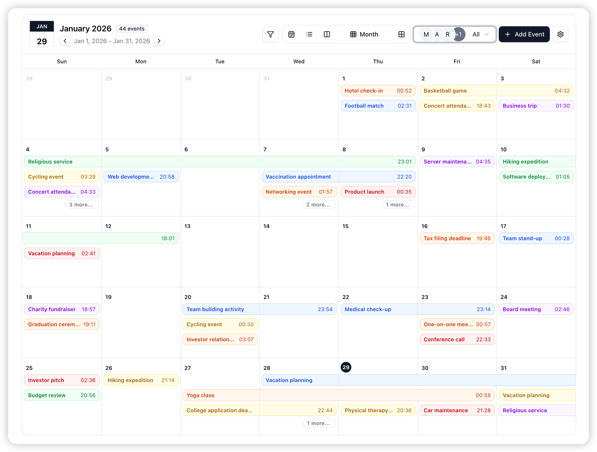

# fullCalendar 연차 캘린더 화면 구현 PRD

## 1. 개요

- **페이지명**: LeaveCalendar (연차 캘린더)
- **라우트**: `/calendar`
- **목적**: fullCalendar 라이브러리를 사용해 사용자별 연차 정보를 시각적으로 표시하고 관리
- **권한**: 모든 사용자 접근 가능 (본인 연차는 USER, 전체 연차는 ADMIN/VIEW)

## 2. 기술 스택

- **라이브러리**:
  - `@fullcalendar/react` ^6.1.20
  - `@fullcalendar/core` ^6.1.20
  - `@fullcalendar/daygrid` ^6.1.20
  - `@fullcalendar/timegrid` ^6.1.20
  - `@fullcalendar/interaction` ^6.1.20
- **스타일**: Radix UI Themes와 호환되도록 CSS 커스터마이징
- **반응형**: CSS Media Query + fullCalendar의 responsive 옵션

## 3. 주요 기능

### 3.1 캘린더 뷰

- **월간 뷰 (dayGridMonth)**: 기본 뷰, 전체 월 단위 연차 표시
- **주간 뷰 (timeGridWeek)**: 주 단위 상세 보기
- **헤더 툴바**: 이전/다음 버튼, 오늘 버튼, 뷰 전환 버튼 (월/주)

### 3.2 필터링 기능

- **사용자 필터**: Multi-select로 특정 사용자들만 표시
- **상태 필터**:
  - "사용 완료" (USED) - `leave_history`에서 조회
  - "사용 예정" (RESERVED) - `leave_reservations`에서 조회
- **연도 필터**: Select로 특정 연도 선택 (2024, 2025 등)

### 3.3 이벤트 표시

- **색상 구분**: 사용자별로 고유 색상 자동 할당 (해시 기반)
- **이벤트 정보**:
  - 제목: `{사용자명} - {FULL/반차AM/반차PM}`
  - 날짜: `YYYY-MM-DD`
  - 툴팁/팝오버: 클릭 시 상세 정보 (연도, 차감량, 상태 등)
- **반응형 축약**:
  - 모바일: 사용자명 약어 (예: "홍길동" → "홍")
  - PC: 전체 정보 표시

### 3.4 날짜 선택 → 연차 신청

- **날짜 클릭 이벤트**: 달력 날짜를 클릭하면
- **Dialog 팝업**: 기존 LeaveRequest 컴포넌트를 Dialog로 재사용
- **선택된 날짜 자동 입력**: 클릭한 날짜가 신청 폼에 자동 설정

### 3.5 반응형 디자인

- **PC (> 768px)**: 전체 캘린더, 모든 정보 표시
- **모바일 (≤ 768px)**:
  - 이벤트 제목 축약
  - 터치로 상세 정보 Dialog 열기
  - 헤더 툴바 아이콘 크기 조정

## 4. 데이터 구조

### 4.1 FullCalendar Event 타입

```typescript
interface CalendarEvent {
  id: string // reservation_id 또는 history_id
  title: string // "{사용자명} - {타입}"
  start: string // YYYY-MM-DD
  allDay: true
  backgroundColor: string // 사용자별 색상
  borderColor: string
  extendedProps: {
    userId: string
    userName: string
    type: LeaveType
    session: LeaveSession
    amount: number
    status: 'RESERVED' | 'USED'
    sourceYear?: number // history인 경우
  }
}
```

### 4.2 API 호출

- `getAllLeaveReservations('RESERVED')` → 사용 예정 이벤트
- `getAllLeaveHistory(startDate, endDate)` → 사용 완료 이벤트
- `getAllUsers('ACTIVE')` → 사용자 목록 (필터용)

## 5. 컴포넌트 구조

```
src/pages/LeaveCalendar/
  ├── index.tsx              # 메인 캘린더 페이지
  ├── LeaveCalendarFilters.tsx # 필터 컴포넌트 (사용자/상태/연도)
  ├── LeaveEventDialog.tsx     # 이벤트 클릭 시 상세 Dialog
  └── LeaveRequestDialog.tsx   # 날짜 클릭 시 신청 Dialog (기존 LeaveRequest 재사용)
```

## 6. 구현 단계

### Phase 1: 기본 캘린더 구현 ✅

1. ✅ fullCalendar 패키지 설치
2. LeaveCalendar 페이지 생성 및 라우터 등록
3. 기본 월간 뷰 렌더링
4. API 연동 (reservations + history)
5. 이벤트 표시 (색상, 제목)

### Phase 2: 필터링 기능

1. LeaveCalendarFilters 컴포넌트 작성
2. 사용자 multi-select 필터
3. 상태 필터 (RESERVED/USED)
4. 연도 필터 (startDate/endDate 계산)

### Phase 3: 뷰 전환 및 반응형

1. 주간 뷰 추가 (timeGridWeek)
2. CSS 커스터마이징 (Radix 테마 매칭)
3. 모바일 반응형 스타일 적용

### Phase 4: 인터랙션

1. 이벤트 클릭 → LeaveEventDialog (상세 정보)
2. 날짜 클릭 → LeaveRequestDialog (연차 신청)
3. 기존 LeaveRequest 컴포넌트 재사용 로직

### Phase 5: 최적화 및 테스트

1. 로딩 상태 처리
2. 에러 핸들링
3. 색상 충돌 방지 (해시 함수 개선)
4. 모바일 터치 이벤트 테스트

## 7. 파일 생성/수정 목록

### 생성

- `src/pages/LeaveCalendar/index.tsx`
- `src/pages/LeaveCalendar/LeaveCalendarFilters.tsx`
- `src/pages/LeaveCalendar/LeaveEventDialog.tsx`
- `src/pages/LeaveCalendar/LeaveRequestDialog.tsx`
- `src/pages/LeaveCalendar/README.md`
- `docs/pages/LeaveCalendar-PRD.md` (이 문서) ✅

### 수정

- `package.json` - fullCalendar 패키지 추가 ✅
- `src/router/index.tsx` - `/calendar` 라우트 추가
- `src/components/layout/Navigation.tsx` - 캘린더 메뉴 추가
- `docs/pages/README.ko.md` - 캘린더 페이지 추가
- `src/lib/supabase/api/leave.ts` - `getAllLeaveHistory`, `getAllLeaveReservations` 이미 구현됨 ✅

## 8. 색상 할당 알고리즘

사용자별 고유 색상을 생성하기 위해 HSL 기반 해시 함수 사용:

```typescript
function getUserColor(userId: string): string {
  // userId를 해시하여 0-360 사이의 hue 값 생성
  let hash = 0
  for (let i = 0; i < userId.length; i++) {
    hash = userId.charCodeAt(i) + ((hash << 5) - hash)
  }
  const hue = Math.abs(hash % 360)

  // 채도와 명도를 고정하여 일관된 색상 생성
  return `hsl(${hue}, 70%, 60%)`
}
```

## 9. 참고사항

- fullCalendar 라이선스: MIT (상업용 사용 가능)
- 기존 LeaveRequest 로직 최대한 재사용
- Radix UI Dialog와 fullCalendar의 이벤트 충돌 방지 필요

## 참고 이미지


